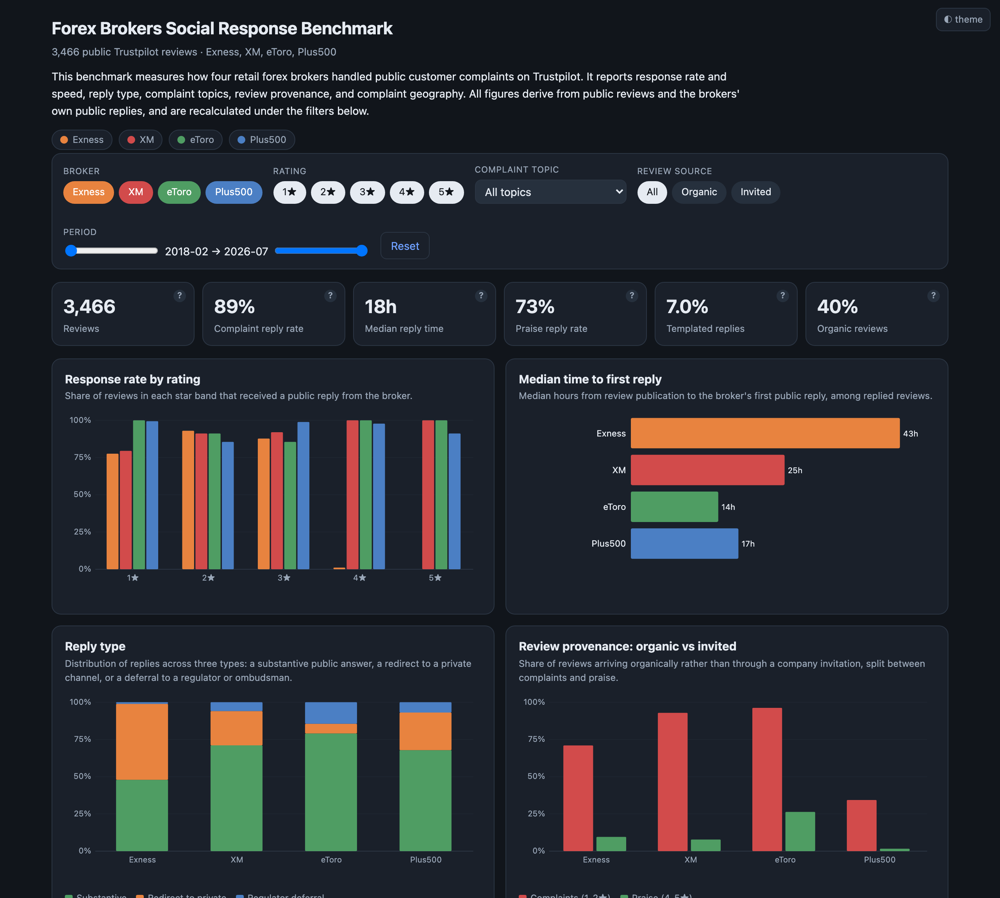

# Forex Brokers Social Response Benchmark

A comparative study of how four retail forex and CFD brokers handle public customer complaints.
The analysis covers 3,466 public Trustpilot reviews of **Exness, XM, eToro and Plus500**, together
with the brokers' own public replies, and measures response rate, response speed, reply type,
complaint composition, review provenance and complaint geography.

Customer service quality in this sector is usually described in marketing terms and rarely
quantified. Public review platforms provide one channel where it can be observed directly, because
both the complaint and the broker's reply carry timestamps and are visible to anyone.



This is an independent analysis, not affiliated with, commissioned by, or endorsed by any company
named in it. It describes observable response behaviour on a public review platform and does not
evaluate the quality, conduct or standing of any broker.

The full written report is in [REPORT.md](REPORT.md).

---

## Summary of findings

**1. Two distinct engagement models are visible in the data.**
Exness replied to 78-93% of its 1-3 star reviews and to very little of its praise (4 star: 1.1%,
5 star: 0%), concentrating response effort on negative feedback. XM, eToro and Plus500 replied
across every star band, including 88-100% of positive reviews.

**2. Response speed differs by a factor of three.**
Median time to a first public reply was 14 hours at eToro, 17 at Plus500, 25 at XM and 43 at Exness.

**3. Response rate and response type measure different things.**
Among replies given, the split between a substantive public answer and a redirect to a private
channel varied widely:

| Broker | Substantive | Redirect to private | Regulator referral |
|---|---|---|---|
| eToro | 79.0% | 6.5% | 14.5% |
| XM | 71.0% | 23.0% | 5.9% |
| Plus500 | 67.8% | 25.3% | 6.9% |
| Exness | 47.9% | 51.0% | 1.1% |

A redirect is frequently the compliant response, since a regulated broker generally cannot discuss
an individual account, its funds, or an open dispute in a public thread. Treating such replies as
non-responses would misread the data, which is why reply type is measured separately from reply
rate.

**4. Most positive reviews were invited rather than spontaneous.**
The share of 4-5 star reviews arriving organically rather than through a company invitation was
26.4% at eToro, 9.5% at Exness, 7.8% at XM and 1.6% at Plus500. Complaints arrived organically for
every broker. A published star rating therefore reflects how actively a company invites
reviews as well as the experience of those who leave them.

**5. Complaint topics differ by broker.**
Share of each broker's 1-2 star reviews mentioning each topic:

| Broker | Leading complaint topics |
|---|---|
| XM | Deposits 46%, Withdrawals 37%, Scam and fraud claims 30%, Support 24% |
| Exness | Withdrawals 27%, Deposits 24%, Platform/execution 22%, Scam and fraud claims 15% |
| eToro | Support responsiveness 30%, Withdrawals 21%, Deposits 16%, Payment rails 16% |
| Plus500 | Withdrawals 20%, Deposits 9%, Scam and fraud claims 9%, Support 8% |

Money movement, meaning withdrawals and deposits, led for all four brokers.

**6. Distinctive complaint phrases differ by broker.**
Ranking the phrases reviewers used by how much more often they appear for one broker than the other
three surfaces distinct subject matter: `cash isa` and `isa account` at eToro (a UK tax-wrapper
product), `deposited inr` and `successfully debited` at XM, `margin levels` and `financial
commission` at Exness, and `high spread` and `open positions` at Plus500. Ranking the same phrases by raw
frequency instead returns only generic terms such as "customer service" for every broker. These are
customers' own words describing their complaints, not verified claims about broker conduct.

**7. Review length scales inversely with rating.**
Average length fell with each additional star: 112 words at 1 star, 75 at 2, 48 at 3, 28 at 4 and
21 at 5.

---

## Interactive dashboard

The findings above are presented interactively in [`dashboard/index.html`](dashboard/index.html),
a single self-contained file that opens in any browser without a server or build step. The data is
embedded and the charts are rendered as SVG in vanilla JavaScript.

The dashboard presents six headline metrics, each annotated with its definition, alongside eight
panels covering response rate by rating, response speed, reply type, complaint topics, review
provenance, complaint geography, review length and distinctive complaint phrases. Filters for
broker, rating, complaint topic, review source and time period recalculate every metric and panel.

---

## Data and method

**Scope.** 3,466 English-language Trustpilot reviews published between February 2018 and July 2026
(Exness 898, XM 728, eToro 920, Plus500 920).

These brokers hold far more reviews than the sample contains: 30,113 for Exness, 3,149 for XM,
31,863 for eToro and 19,571 for Plus500 at the time of capture. Trustpilot's public listing returns
roughly 200 reviews per filtered view, so reviews were collected one star band at a time, giving up
to about 200 from each of the five bands per broker. Sampling evenly across bands is also
deliberate: it yields enough 1 and 2 star reviews to analyse complaint handling, which a
proportional sample would not. The sample therefore does not mirror any broker's true rating
distribution, which is why every measure is reported within a rating band rather than as a blended
figure. It is also weighted towards recent activity, with 81% of sampled reviews published in 2025
or 2026.

**Collection.** Trustpilot serves its review pages behind a JavaScript bot challenge, so scripted
requests are rejected. `collect_trustpilot.py` clears the challenge once in a real browser session,
then paginates through results using same-origin requests and parses the review data embedded in
each page. Reviews are retrieved per star band because each listing view returns roughly 200
results.

**Classification.** `prepare_dataset.py` assigns complaint topics using explicit keyword
dictionaries, classifies each broker reply as substantive, redirect or regulator referral, flags
templated replies by detecting reused reply openings, and derives length and provenance fields. The
dictionaries are defined at the top of that file so the classification can be inspected and revised
rather than accepted on trust.

**Analysis.** Metrics are computed within each rating band and then compared across brokers.

### Limitations

- The sample is stratified by star band rather than mirroring each broker's true rating
  distribution. Metrics are therefore reported per rating band and not as a single blended rate,
  and no figure here should be read as an estimate of a broker's overall review profile.
- The sample is weighted towards recent reviews, so it reflects current practice more than
  historical practice. XM's smaller review base yields smaller cells in its 2 and 3 star bands
  (68 and 100 reviews), where percentages rest on fewer observations.
- Reply-type and template classifications are keyword and similarity heuristics rather than
  human-labelled judgements.
- Coverage is limited to English-language reviews on the Trustpilot `.com` view, so multilingual
  response behaviour is not captured.
- Trustpilot is a single channel. It supports this analysis because replies are public and
  timestamped, but it does not represent a broker's whole support operation.

---

## Repository contents

```
├── REPORT.md                       Full written report
├── dashboard/
│   ├── index.html                  Interactive dashboard (self-contained)
│   └── preview.png                 Dashboard screenshot
├── data/
│   ├── complaint_phrases.json      Distinctive complaint phrases per broker
│   └── benchmark_metrics.json      Headline metrics per broker
└── scripts/
    ├── collect_trustpilot.py       Retrieves reviews and broker replies
    ├── prepare_dataset.py          Classifies topics and replies, builds the dataset
    ├── build_dashboard.py          Generates the dashboard from the dataset
    └── analyze_trustpilot.py       Command-line summary of response metrics
```

Running the pipeline below builds the analysis dataset locally as
`data/broker_reviews_clean.csv`, with these columns:

`brand`, `rating`, `month`, `pub_date`, `source`, `is_organic`, `country`, `language`, `verified`,
`replied`, `response_hours`, `reply_type`, `is_template`, `word_count`, `exclaim`, `features`,
`title`, `text`.

---

## Reproduction

The pipeline runs in three stages. Collection requires Playwright; the remaining stages use only the
Python standard library.

```bash
# 1. Retrieve reviews and broker replies
pip install playwright && playwright install chromium
python scripts/collect_trustpilot.py exness.com  --pages 40 --out data/exness.json
python scripts/collect_trustpilot.py xm.com      --pages 40 --out data/xm.json
python scripts/collect_trustpilot.py etoro.com   --pages 40 --out data/etoro.json
python scripts/collect_trustpilot.py plus500.com --pages 40 --out data/plus500.json

# 2. Classify topics and replies, and build the analysis dataset
python scripts/prepare_dataset.py data/*.json

# 3. Generate the dashboard
python scripts/build_dashboard.py
```

---

## Notes on the data

All source material is public: reviews readable on Trustpilot without an account, and the brokers'
own public replies. No private or authenticated data is used and no individual reviewer is
identified. The review content belongs to Trustpilot and its reviewers, so this repository publishes
the code and the aggregate results rather than the reviews themselves. Figures represent a snapshot
taken in July 2026 and will drift as the brokers accumulate further reviews.

## License

Released under the MIT License. See [LICENSE](LICENSE).
